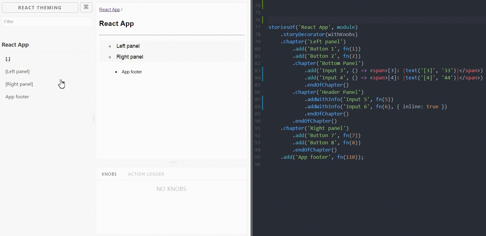

# storybook-chapters 
[](https://badge.fury.io/js/storybook-chapters)
[](https://sm-react.github.io/storybook-chapters)

This **addon** for React Storybook adds unlimited levels of **nesting for stories**. 


[](https://raw.githubusercontent.com/sm-react/storybook-chapters/master/doc/img/preview.gif)


## Usage

```shell
yarn add storybook-chapters --dev
```

```js
// .storybook/config.js:

import 'storybook-chapters';

```

```js
// stories.js:

storiesOf('React App', module)
    .chapter('Left panel')
        .add('Button 1', fn(1))
        .add('Button 2', fn(2))
        .chapter('Bottom Panel')
            .add('Input 3', fn(3))
            .add('Input 4', fn(4))
            .endOfChapter()
        .chapter('Header Panel')
            .add('Input 5', fn(5))
            .add('Input 6', fn(6))
            .endOfChapter()
        .endOfChapter()
    .chapter('Right panel')
        .add('Button 7', fn(7))
        .add('Button 8', fn(8))
        .endOfChapter()
```

## Features

- The hierarchical structure of Substories
- Hide/show your stories with `enable`/`disable` and buid your own navigation
- Compatible with `Knobs`, `addWithInfo` and other addons
- Use `storyDecorator` to wrap all chapters

## Examples

### Basic

[story](https://github.com/sm-react/storybook-chapters/blob/master/example/basic/src/stories/index.js)

Lets add 'chapters' to [Storybook Boilerplate](https://github.com/sm-react/react-theming#storybook-boilerplate-project):

```shell
git clone https://github.com/sm-react/storybook-chapters.git
cd storybook-chapters/example/basic
yarn
yarn start

```

### Choose your side with Enable / Disable API

[story](https://github.com/sm-react/storybook-chapters/blob/master/example/enable/src/stories/index.js)

```shell
git clone https://github.com/sm-react/storybook-chapters.git
cd storybook-chapters/example/enable
yarn
yarn start
```

## API

You can access chapters features as addons (methods) of `storiesOf`.

>example: `storiesOf('React App', module).chapter('Left panel')`

To enable chapters you need to apply one of these addons first:

```js
// right:
storiesOf('React App', module).chapter('Left panel').add('item1', fn());
storiesOf('React App', module).enable().add('item1', fn());

// wrong:
storiesOf('React App', module).add('item1', fn()).chapter('Left panel');

```

Here're the list af available addons:

- `.chapter(name, ToC)` enables "chapters", init root chapter and adds subchapters to `storiesOf`. You can use .add() to add stories to this chapter and .chapter() to add subchapters.

- `.add(name, story)` add stories to current chapter

- `.endOfChapter()` jumps to the parent chapter.

- `.storyDecorator(decorator)` adds decorators to whole `storiesOf` (including subchapters). Enables "chapters". You can put it in any place of chapters tree, result will be the same.

- `disable(enableFn => {})` - temporarily hides current `storiesOf`. `enableFn()` - function to hide/show these stories:

```js
enableFn(true)  // to show this stories
enableFn(false) // to hide this stories
```
It enables "chapters"

- `enable(enableFn => {})` - don't hide current `storiesOf` but provides function `enableFn()` to control visibility of these stories. Enables "chapters"

You can use `enable`/`disable` to build custom navigation with your preferred logic. 
For example, you can use `enableFn()` in another stories, decorators or [addon panels](#roadmap) 

## Roadmap

- Use query params to store current (sub)chapter in address string

- Custom TOC

- Bookmarks

- Custom addon panel

- Chapter decorators

## Warning

Use carefully since it in early stages. It's fairly experimental approach of addon creating. 

## Credits

We'd be happy to receive feedback from this project. Any issue or PR will be appreciated!

<div align="left" style="height: 16px;"><sub>Created with ❤︎ to <b>React</b> and <b>React Storybook</b> by <a href="https://twitter.com/UsulPro">@UsulPro</a> and     <a href="https://github.com/sm-react/react-theming">React Theming</a>.</sub></div>
